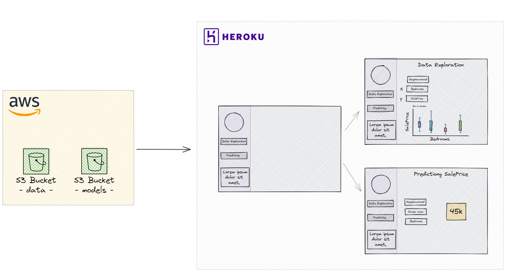

# House Prices Regression

Kaggle's house prices regression

### App

The app in development can be seen [here](https://house-prediction-porquito.herokuapp.com/).
### Wireframe

The image below represents how we want to present data and the predictions.



### To Develop this project

```bash
pip install pipenv
pipenv install --dev --skip-lock
```

### Project Organization

This project uses the [DS cookiecutter](https://drivendata.github.io/cookiecutter-data-science/) project's structure.

---

<p><small>Project based on the <a target="_blank" href="https://drivendata.github.io/cookiecutter-data-science/">cookiecutter data science project template</a>. #cookiecutterdatascience</small></p>
